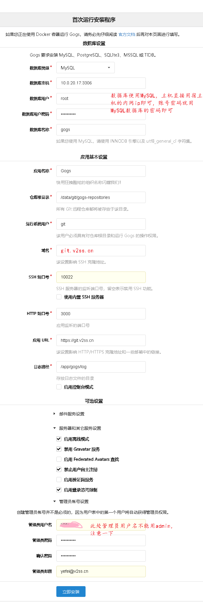

> 使用docker安装gogs并配置域名，含域名证书

### 一、准备和说明
- Linux环境
- 已经安装过docker
- 已经分配过域名且域名含有https证书

### 二、`docker`启动gogs镜像并挂载目录等

尽量使用最新镜像，防止乱七八糟的bug和不和谐的情况发生。

```sh
# 拉取镜像
docker pull gogs
# 创建挂载目录
mkdir -p /data/gogs/
# 运行容器
docker run --name=gogs --restart=always -d -p 10022:22 -p 10086:3000 -v /data/gogs:/data gogs/gogs
# 重启镜像
docker restart gogs
```

说明一下：外网防火墙要开放10022和10080端口，所有的gogs产生的内容全部挂载在宿主机`/data/gogs`目录下面，如果容器有问题，可以随时备份重启

### 三、配置nginx反向代理域名（含证书）

`nginx`配置此时和一般的反向代理略微有点小区别，但是区别不大，直接上配置代码：

```
server {
    listen 443 ssl;
    server_name git.v2ss.cn;
    ssl_certificate   cert/git.v2ss.cn_bundle.pem;
    ssl_certificate_key  cert/git.v2ss.cn.key;
    ssl_protocols TLSv1 TLSv1.1 TLSv1.2 TLSv1.3;
    ssl_ciphers ECDHE-RSA-AES128-GCM-SHA256:HIGH:!aNULL:!MD5:!RC4:!DHE;
    ssl_prefer_server_ciphers on;
    ssl_session_cache shared:SSL:10m;
    ssl_session_timeout 10m;
    error_page 497  https://$host$request_uri;
    location / {
        proxy_set_header  X-Real-IP  $remote_addr;
        proxy_pass http://10.0.20.17:10086$request_uri;
    }

    #禁止访问的文件或目录
    location ~ ^/(\.user.ini|\.htaccess|\.git|\.svn|\.project|LICENSE|README.md)
    {
        return 404;
    }

}
```

配置完事后重启`nginx`，或者：`nginx -s reload`

### 四、填写`gogs配置`信息

不出意外此时gogs的web管理段已经启动，可以直接访问： https://git.v2ss.cn/install。本页面能且只能访问一次，配置好了就不能再次访问了。



### 五、登陆测试

直接登陆一顿操作就可以了

### 六、说明：

目前最新版好像有问题，本文用的版本是`0.12`